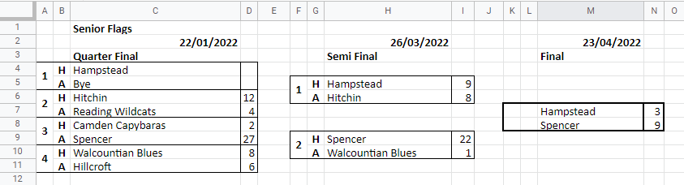

# Fixtures Sheet Format

All fixtures, league, and flags data is loaded from a spreadsheet on Google Sheets. The spreadsheet **must be shared** so anyone can view.

There are [Instructions on how to modify this sheet](fixtures-sheet.md) during the season, but the most important instruction is **never delete a row** once the fixtures are published, after that games must have a score, be conceded, rearranged, or void.

You should add a link to the instructions from whatever the first sheet is, usually Fixtures.

The simplest way to understand the format is to visit the [previous Fixtures Sheets](https://drive.google.com/drive/folders/1SoT-hiBgRW_PLNRSLEkzcjbGobhXRanf?usp=sharing), and have a look at the latest version.

The number of points for wins/draws/loses and the tie-break options can be set on the SEMLA Settings page in WordPress Admin (this option may only be available to Administrators).

**IMPORTANT:** There is practically no validation in the programs which update from the Fixtures Sheet. Therefore if you mess with the format of the spreadsheet don't be surprised if everything breaks!

It is suggested you add data validation where you can to restrict values users can put in. To do that select the cells, choose Data->Data validation, and enter the restriction. There are examples below.

There must be 5 sheets named Fixtures, Flags, Deductions, Teams, and Divisions. There is also an optional sheet for Division Order.

The Teams and Divisions sheets are only needed to set up the season. These sheets can be hidden during the season, and only unhidden when you need to do any changes. Therefore, if you copy over the sheet from the previous year as your starting point make sure to unhide these sheets so you can work on them (use the All Sheets menu, which is the 3 lines icon in the bottom left by the sheet names - hidden sheets will be greyed out, select to unhide).

## Teams Sheet

Lists all teams and their info. Must have the following columns in this order:

* `Team` - use consistent naming. For university teams use the name of the university + Uni, so `Bath Uni` not `University of Bath`. You can use the full name for the club name, but keep team names short, and in better alphabetical order
* `Club` - should match the title of their club page
* `Club Page` - the club page slug, so for Bath their page is at `/clubs/bath`, and the slug will be `bath`
* `Pitch Type` - anything here will appear on the Fixtures page if the game hasn't been played yet. It is suggested you keep this consistent, so use `3G`, `Astro`, or `Sand Astro`

Team meta data can be updated in the WordPress Admin under `SEMLA->Teams`. There should set:

* `Abbreviation` -  used where long names would overflow the space. such as mini tables, flags draws, and fixtures on small screens
* `Minimal` - used for column headings in the Fixtures Grid, so keep it to 6 characters maximum

## Divisions Sheet

Lists all divisions, the league they are in, and other info, specifically the list of teams competing. If you introduce a new league or division you may need to [add a competition for it](fixtures-tables-history.md#competitions-and-groups).

Leagues separate the Divisions, for example into SEMLA and Local. Tables for each league are displayed on the home page in a separate tab, and each league should have separate Tables and Fixtures Grid pages. If you add a new league then you should add a Tables and Fixtures Grid page for it, and add the appropriate "SEMLA Data" block to those pages.

You must have the following columns in this order:

* `League` - currently SEMLA or Local
* `Division` - within the league, so for "Local London 1" this would be "London 1"
* `Full` - full name, just set this column to concatenate the previous 2, so `=A2&" "&B2`
* `# Promoted`
* `# Relegated`
* `Fixtures Sort Order` - how to order the fixtures. See below for more detail.
* `Teams` - add all teams in as many columns you need to the right

Only the first letter is used to determine the sort order, but you should put in the full name to make it obvious.

* `Default` - sort by date, competition (ranked by sequence), home team
* `Venue/time` - some competitions e.g. Local Midlands play a 3-way round-robin at one venue, so for those you can sort by date & competition as normal, and then venue & time, and then home team.

Add any ladders (e.g. Division 1 and 2 teams play each other, with the results counting in their respective divisions), but omit teams. The ladder must have a row on the `sl_competition` table, with type = "ladder", and ladder_comp_id1 and ladder_comp_id2 set to the divisions it relates to, e.g. "SEMLA Division 1/2 Ladder" has comp_ids for "SEMLA Division 1" and "SEMLA Division 2".

## Deductions Sheet

Columns are `League & Division` (must be Full name from Divisions Sheet), `Team`, `Penalty` (must be positive value), `Date`, `Reason`.

## Fixtures Sheet

The columns can be in any order, but they must have a heading in row 1 exactly as specified. `Competition`, `Date`, `Time`, `Home`, `Home Goals`, `v`, `Away Goals`, `Away`, `X`, `Notes`, `Venue`.

The `Competition` for league matches must be the League and Division, so if the league is "SEMLA" and the Division is "Premier Division", then the value must be "SEMLA Premier Division". For Flags matches use the full flags competition with the round name abbreviation, so "Senior Flags R16" or "Minor Flags F".

It is recommended to leave the `Venue` column blank unless the game is not at the home team's ground, as if no Venue is specified then the Home team is assumed. If you are going to use it then use the full team name. If you put in a different name to the Home team, e.g. Home is "Cambridge Eagles" and Venue is "Cambridge Uni", then it will be assumed the game is played at a different venue, so on the Fixtures page it will display "at Cambridge Uni", which is silly. It is also important to use the full team name as otherwise the pitch type cannot be displayed on the Fixtures page for upcoming games.

Team names must match the name in the Teams sheet. If team names are changed make sure to "Update everything" on the SEMLA Admin page to reload the teams & league setup.

You can set up data validation as below, though if you copy over the previous year's sheet as a staring point the validation should already be there. Go to Data->Data validation, and you can see existing rules, and also add new ones. When you create a new rule you should also open up the "Advanced options" and select to "Reject the input" if data is invalid.

The `v` column is used to mark where a match is, and to mark if a match is conceded. If you enter rows without matches on them you should make sure this column is blank. You should set data validation to Drop-down and add 3 items of v, C, and C24. In Advanced options set the `Display style` to `Plain text`, and add a comment to the heading cell `v - normal game, C - conceded (score should be 10-0), C24 - conceded within 24 hours (score should be 10-0), conceding team gets -1 points, blank - no game`.

You will also probably find it useful to have data validation on the goals columns, so if you have goals in column E then add validation for "Custom formula", and enter `=OR(ISNUMBER(E2),AND(LEN(E2)=1,IFERROR(FIND(E2, "ACRV"),0)>0))`. You can have this rule apply to 2 columns by setting the range to include both columns, e.g. `Fixtures!E2:E269,Fixtures!G2:G269`

Column `X` is the points multiplier, which defaults to 1. To make life easier you should set the column header `={"X";ARRAYFORMULA(IF(ISTEXT(E2:E),,IF(REGEXMATCH(J2:J,"(?i)double"),2,)))}` (assumes goals in E and notes in J), that way it will automatically make a match count for double points if the Notes column has "double" anywhere in it. Make sure you add a note to the column heading `Points multiplier - default 1, 2 for double points games`.

The `Notes` column isn't used by our programs, but is a useful place to add things like the date a match is rearranged from/to, if it's double points etc.

You may have divisions, for example the Local Midlands, where teams play tournaments at various venues, but still play each other twice. In this case make sure that for every pairing of teams each team is the Home team once, and the Away team once, as otherwise the matches will display  oddly on the Fixtures Grid.

Once a season is set up, and dates are set up on the Flags sheet, then you can add Flags matches to the main Fixtures sheet with the teams and scores automatically added from the Flags sheet. Use the Flags Fixtures Formulas tab on the SEMLA WordPress Admin page to get the formulas to paste.

### Missing Results

You may find it useful to add an extra column to show the status of match, i.e. if it's not rearranged or has no result. The following formula can be added in the heading row `={"Status";ARRAYFORMULA(IF(F2:F<>"v",,IF(B2:B<TODAY(),IF(ISBLANK(E2:E),"No result",IF(REGEXMATCH(J2:J,"TBA"),"Not rearranged",)),)))}`. This assumes the "v" column is F, the date in B, home goals in E, and notes in J, and that rearranged matches with no future date have 'TBA' in the Notes. It will only display a status if the match date is before today.

You can also highlight rows with missing results by selecting the range to highlight (probably A2:L), then Format->Conditional Formatting, and choose "Custom Formula is", and enter `=NOT(ISBLANK($L2))` and click Done. This assumes that L is the Status column.

To only show missing results you can filter on the Status column, or if you could create a separate tab to show them. To show all columns use `=FILTER(Fixtures!A2:L,NOT(ISBLANK(Fixtures!L2:L)))`, of to limit the columns you can use something like `=FILTER({Fixtures!A2:B,Fixtures!D2:J,Fixtures!L2:L},NOT(ISBLANK(Fixtures!L2:L)))`.

## Flags Sheet

This sheet has to be in a rigid structure. It must be:

* Line 1: Competition name in column C
* Line 2: Date of round in column C, and repeated every 5 columns. Make sure these cells have the format of Date.
* Line 3: Round names in column C, and repeated every 5 columns. Rounds should be "Last x", "Quarter Final", "Semi Final" or "Final" (note: no "s" on the end)
* Grid of matches - see below
* If there are more flags competitions then there must be 2 blank rows, and then repeat as above

For the grid of matches, the first round should have no gaps between matches, and column B needs H/A markers for Home or Away team, or NH and NA for neutral venues, as one team is still
"home". Column A can have match numbers, but these aren't used.

The next round should have teams in column H, and H/A in column G, and then repeat across every 5 columns until the final. It is very important each match except finals have an H/A, as this is what the programs use to determine where a match is. You also need to get the matches in the correct order, as the top 2 matches in round 1 are assumed to feed into match 1 in round 2 etc. If you have done the draw in a funny way then you will need to unwind the draw so that it is in the correct order, so for example if round 2 match 1 is the winners from matches 3 and 5 from round 1 then you need to put matches 3 and 5 into positions 1 and 2 on the sheet respectively. You
can put the match number in column A for reference.

If a team has a bye into round 2 then it must be put into round 1 as one of the teams, with the other as Bye. If you need comments then use column E, so for example if the Intermediate Flags trickles down into the minor then put "Loser Int R1 Game 7" in column E next to the slot in
the draw. You can also put it in the team name, but that is not recommended.

You should also put borders around matches to make reading the sheet easier, e.g.

## Remarks

Competitions remarks, which will be displayed under the league table or flags draw, can be added in WordPress Admin under `SEMLA->Remarks`.

## Division Order Sheet

Optional sheet used to order divisions in a specific order, e.g. if the final positions were set using a Final Four competition. The top row should be the full competition name, and the teams must  be listed in the correct order in that column. If there are no Division Orders then make sure to delete this sheet.
